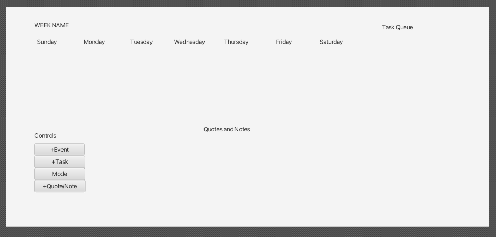

# 3500 PA05 Project Repo

[PA Write Up](https://markefontenot.notion.site/PA-05-8263d28a81a7473d8372c6579abd6481)

Week GUI View (Temporary):

Final Week GUI:

Program Pitch: 
The Bujo Bullet Journal App is the perfect app for those looking to add a personalized and
fun approach to organizing and time management! With this new app users are presented with a
neat, organized panel showcasing all events and tasks listed below each day. Tasks and events
can be added, edit, and deleted depending on user preference. All actions (task or events) get a 
name, optional description, and day to which the action is assigned. Start and end time can be 
adjusted for events, and completion status can be marked for tasks. All tasks will be depicted in the 
BuJo's Task Queue to act as a to-do list for the user. The BuJo app contains a light purple-lilac
theme, easy on the eyes, and perfect for creating a positive environment around the user's weekly
actions. With this BuJo app, people can lay out their weekly schedule with a few easy clicks and save
it in new .bujo files for later use!

SOLID Principles
Single Responsibility Principle: The UserInputView class is located in the View folder of this project.
This class, like all view classes, implements teh BujoView interface. This class is only responsible for 
loading the first scene the program displays once executed. This class has one responsibility: to load 
the correct fxml file and make sure the user's input in the scene that appears is a valid input, it
has no other responsibility or function, therefore following the single responsibility principle.

Open/Close Principle: The BujoViewImpl class implements the interface BuJoView and displays the scenes
for the BuJo application. This class is closed for modification, as it contains methods that showcase
the GUIs for a week and popups. Because this class implements the BoJuView interface, it is extendable
when new functionality needs to be added. For example, in this prpject when displaying the welcome 
screen or displaying the user input screen was needed, code inside the BuJoViewImpl class did not need 
to be altered. Instead, new classes were created for these two new functionalities, both of which 
implemented the same BoJuView interface. This made it possible for all 3 view classes to implement the
load() method slightly differently to display the correct scene for the program. If a new functionality
needed to be added in the future, it would be easy to create a new view for that functionality.

Liskov Substitution Principle: The Event and Task classes extend the Action class. Therefore, in Event 
or Task is by definition an Action through extension. The two classes share the same 3 fields of name,
description , and dayOfWeek. T

Interface Segregation Principle:
Dependency Inversion Principle:

Extensions and More: 